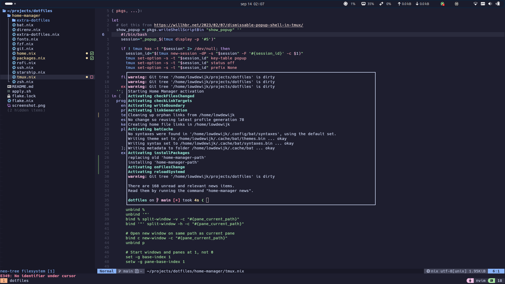

# Dotfiles++

This repo is a little more than just some dotfiles. It uses Nix [home-manager](https://github.com/nix-community/home-manager) to manage the entire terminal environment, including all the apps that I use on the terminal, such as neovim and tmux.

## My terminal environment
 
 - kitty, dotfiles are included but kitty itself is not (theme = catppuccin)
 - tmux (theme = catppuccin)
 - neovim (theme = catppuccin) 
 - zsh (no oh-my-zsh, but heavily customized)
 - git
 - eza (instead of ls)
 - bat (instead of cat)
 - fzf
 - a whole bunch of other terminal commands...



## Installation

Pre-requisites:
 - Nix (enable flake support)
 - Kitty

NOTE: my username is set hardcoded to `lowdewijk` in home.nix. If you are not `lowdewijk` then update it there.

Clone this repo then run:
```bash
./apply.sh
```

Start kitty and enjoy!

## Extra zsh config

For extra zsh config please use: `$HOME/.extra_zshrc`.
